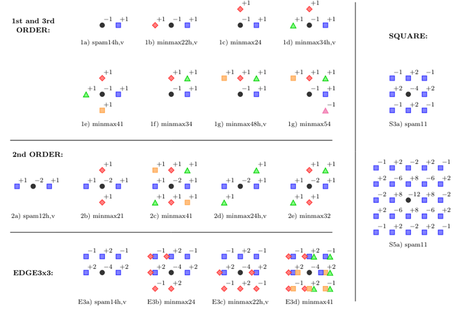
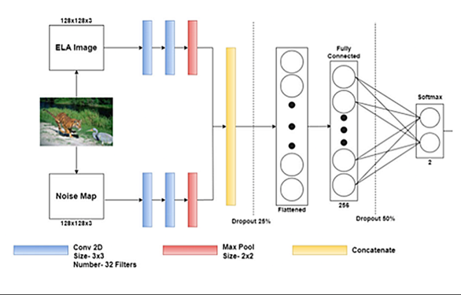

# Image Forgery Detection and Authentication using a Dual-Branch CNN with SRM and ELA for hidden feature extraction

The objective of this project is to detect forged images using deep learning techniques by leveraging hidden data within the images. A dual-branch Convolutional Neural Network (CNN) is employed, utilizing **Error Level Analysis (ELA)** and **Spatial Rich Model (SRM)** filtering to improve the accuracy of image forgery detection. This approach demonstrates the effectiveness and potential of combining ELA and SRM in detecting subtle manipulations in images, and the model has been trained and evaluated on several prominent datasets.

For access to the full research paper or the executive summary for this project please contact me at KarimElgazar74@gmail.com

## Project Overview

In today's digital age, image manipulation is easily accessible through widely available software. This project addresses the need to identify and authenticate forged images to ensure the integrity of digital content. The proposed model utilizes both ELA and SRM filtering as preprocessing steps to detect discrepancies indicative of forgery in the image data.

### Key Features

- **Dual-Branch CNN**: Two branches of CNN architecture, one for ELA-processed images and one for SRM-filtered images.
- **Datasets**: The model was trained and evaluated on three prominent datasets:
  - CASIA V2
  - CoMoFoD (small)
  - MICC-F2000
- **Performance**: The model achieved near state-of-the-art performance with an accuracy of 98.00% on the MICC-F2000 dataset and 96.18% on the CASIA V2 dataset.
- **Metrics Used**: Accuracy, Precision, Recall, and F1-Score were used for performance evaluation.

## Installation

To run this project, follow the steps below:

1. Clone the repository:
   ```bash
   git clone https://github.com/KarimElgazaar/image-forgery-detection.git
   ```
2. Install the required dependencies:
   ```bash
   pip install -r requirements.txt
   ```

## Datasets

The project utilizes the following datasets:
- **CASIA V2**: Contains 12,614 images, including copy-move and splicing forgeries.
- **CoMoFoD (small)**: 10,000 images focused Exclusively on copy-move forgery. 
- **MICC-F2000**: 2000 High-resolution images with copy-move forgery.

Ensure you download the datasets and update the file paths accordingly in the preprocessing scripts.
update the real_path and fake_path variables in the preprocessing files according to the paths of your dataset
## Usage for CASIAV2 as an example

1. **Preprocess the datasets**:
   The preprocessing step converts images to ELA and SRM representations.
   ```bash
   python CASIAV2preprocessing.py 
   ```
2. **Train the model**:
   Train the dual-branch CNN using the preprocessed data.
   ```bash
   open the CASIAV2run.ipynb and execute all the cells
   ```
3. **Evaluate the model**:
   Evaluate the model performance on the test set.
   ```bash
   the last few cells contain the evluation of the model
   ```

## Model Architecture

The CNN model architecture consists of two branches:
- **SRM Branch**: This branch processes the images using Spatial Rich Model (SRM) filters, which highlight noise patterns that may indicate forgery.
- <p align="center">
  
</p>
- **ELA Branch**: This branch processes the images using Error Level Analysis (ELA), which highlights compression artifacts indicative of manipulation.

  
<p align="center">
  
</p>

Both branches are concatenated, followed by fully connected layers, and the final output is the classification of the image as real or forged, either a 1 if the image is deemed to be real or 0 if the image is classified as forged.

## Results

- **CASIA V2**: Accuracy 96.18%, Precision 96.92%, Recall 98.23%, F1 Score 97.57%
- **MICC-F2000**: Accuracy 98.00%, Precision 94.59%, Recall 100.00%, F1 Score 97.22%
- **CoMoFoD (small)**: Accuracy 89.25%, Precision 88.52%, Recall 90.20%, F1 Score 89.35%

## Future Work

- Integration of a pre-trained model for feature extraction (e.g., ImageNet, YOLO).
- Expansion to localization and natural language description of image forgeries using transformers.
- Further exploration of hybrid preprocessing techniques.

